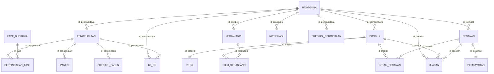

# Smart Lettuce Cultivation & Marketplace Management System
## API Documentation & Indonesian ERD Integration Guide

Dokumentasi lengkap REST API Backend yang telah disesuaikan secara menyeluruh dengan **Entity Relationship Diagram (ERD) Bahasa Indonesia**.

---

## 🗄️ Struktur Database & ERD Bahasa Indonesia

Backend ini menggunakan 17 tabel terstruktur dengan penamaan Bahasa Indonesia dan relasi terstandardisasi:



---

## 📋 Daftar Tabel & Kolom

1. **`pengguna`**: `id_pengguna`, `nama`, `email`, `password_hash`, `no_telepon`, `role` (`PEMBUDIDAYA`, `PEMBELI`), `foto_profil`, `created_at`, `updated_at`
2. **`fase_budidaya`**: `id_fase`, `nama_fase` (Semai, Vegetatif, Pendewasaan, Panen), `urutan_fase`
3. **`pengelolaan`**: `id_pengelolaan`, `id_pembudidaya`, `kode_pengelolaan`, `tanggal_tanam`, `jumlah_tanaman`, `lokasi`, `kondisi_tanaman`, `kondisi_air_nutrisi`, `kondisi_instalasi`, `kondisi_lingkungan`, `nilai_ph`, `catatan`, `created_at`, `updated_at`
4. **`perpindahan_fase`**: `id_perpindahan`, `id_pengelolaan`, `id_fase`, `tanggal_mulai`, `tanggal_selesai`, `catatan`
5. **`panen`**: `id_panen`, `id_pengelolaan`, `tanggal_panen`, `jumlah_panen`, `berat_total_kg`, `kualitas`, `catatan`
6. **`to_do`**: `id_todo`, `id_pembudidaya`, `id_pengelolaan`, `nama_tugas`, `tanggal_tugas`, `status` (boolean), `created_at`
7. **`notifikasi`**: `id_notifikasi`, `id_pengguna`, `id_pengelolaan`, `jenis_notifikasi`, `isi_notifikasi`, `status_dibaca`, `waktu_notifikasi`
8. **`prediksi_panen`**: `id_prediksi_panen`, `id_pengelolaan`, `status_kesiapan`, `perkiraan_tanggal_mulai`, `perkiraan_tanggal_selesai`, `nilai_prediksi`, `created_at`
9. **`prediksi_permintaan`**: `id_prediksi_permintaan`, `id_pembudidaya`, `periode_mulai`, `periode_selesai`, `tanggal_prediksi`, `hasil_prediksi`, `satuan`, `created_at`
10. **`produk`**: `id_produk`, `id_pembudidaya`, `nama_produk`, `deskripsi`, `harga`, `foto_produk`, `status_produk` (boolean)
11. **`stok`**: `id_stok`, `id_produk`, `jumlah_stok`, `tanggal_update`
12. **`keranjang`**: `id_keranjang`, `id_pembeli`, `created_at`, `updated_at`
13. **`item_keranjang`**: `id_item_keranjang`, `id_keranjang`, `id_produk`, `jumlah`, `harga_satuan`, `created_at`, `updated_at`
14. **`pesanan`**: `id_pesanan`, `id_pembeli`, `tanggal_pesanan`, `total_harga`, `metode_pembayaran` (`QRIS`, `COD`), `status_pesanan` (`MENUNGGU_PEMBAYARAN`, `DIBAYAR`, `DIPROSES`, `SIAP_DIAMBIL`, `SELESAI`, `DIBATALKAN`)
15. **`detail_pesanan`**: `id_detail`, `id_pesanan`, `id_produk`, `jumlah`, `harga_satuan`, `subtotal`
16. **`pembayaran`**: `id_pembayaran`, `id_pesanan`, `id_pembudidaya`, `metode_pembayaran`, `status_pembayaran` (`MENUNGGU`, `LUNAS`, `GAGAL`, `KADALUARSA`, `DIBATALKAN`), `jumlah_bayar`, `order_id_gateway`, `id_transaksi_gateway`, `snap_token`, `redirect_url`, `waktu_kadaluarsa`, `waktu_pembayaran`, `respons_gateway`
17. **`ulasan`**: `id_ulasan`, `id_produk`, `id_pembeli`, `id_pesanan`, `rating` (1-5), `komentar`, `tanggal_ulasan`

---

## 🚀 Menjalankan Server & Database Seeder

```bash
# Jalankan migrasi dan isi data realistis dalam Bahasa Indonesia
php artisan migrate:fresh --seed

# Jalankan server API
php artisan serve
# Berjalan di: http://127.0.0.1:8000
```

Akun Demo bawaan Seeder:
- **Pembudidaya**: `petani@lettuce.com` / `password123` (Role: `PEMBUDIDAYA`)
- **Pembeli**: `pembeli@lettuce.com` / `password123` (Role: `PEMBELI`)

---

## 📚 Ringkasan Endpoint API (Prefix: `/api/v1`)

### 1. Autentikasi & Profil (`Public / Protected`)
- `POST /api/v1/auth/register` — Registrasi (`nama`, `email`, `password`, `role`: `PEMBUDIDAYA` / `PEMBELI`)
- `POST /api/v1/auth/login` — Login & dapatkan token Sanctum
- `POST /api/v1/auth/logout` — Logout token aktif
- `GET /api/v1/profile` — Profil user aktif
- `PUT /api/v1/profile` — Update profil (`nama`, `no_telepon`, `foto_profil`, `password`)

### 2. Modul Pembudidaya (`role: pembudidaya / cultivator`)
- `GET /api/v1/dashboard` — Metrik ringkasan budidaya, AI prediksi, pesanan & to-do
- `GET /api/v1/fase-budidaya` — Data master tahapan fase pertumbuhan
- `GET /api/v1/pengelolaan` atau `/batches` — Daftar batch budidaya
- `POST /api/v1/pengelolaan` atau `/batches` — Buat batch baru
- `GET /api/v1/pengelolaan/{id}` — Detail batch + riwayat fase & panen
- `PUT /api/v1/pengelolaan/{id}` — Update parameter & kondisi batch
- `DELETE /api/v1/pengelolaan/{id}` — Hapus batch
- `POST /api/v1/pengelolaan/{id}/fase` — Catat perpindahan fase tanaman
- `POST /api/v1/pengelolaan/{id}/panen` — Catat panen batch
- `GET /api/v1/pengelolaan/{id}/prediksi-panen` — Prediksi AI kesiapan & estimasi panen
- `GET /api/v1/prediksi-permintaan` — Prediksi AI permintaan pasar
- `GET /api/v1/to-do` atau `/tasks` — Daftar to-do list harian
- `POST /api/v1/to-do` atau `/tasks` — Buat to-do tugas harian baru
- `POST /api/v1/to-do/{id}/complete` — Tandai to-do selesai
- `POST /api/v1/produk` — Tambah produk selada ke marketplace
- `PUT /api/v1/produk/{id}` — Update info & stok produk
- `DELETE /api/v1/produk/{id}` — Hapus produk
- `GET /api/v1/cultivator/orders` — Daftar pesanan masuk dari pembeli
- `PUT /api/v1/cultivator/orders/{id}/status` — Update status pesanan

### 3. Modul Pembeli & Marketplace (`role: pembeli / buyer`)
- `GET /api/v1/produk` atau `/products` — Katalog marketplace selada segar
- `GET /api/v1/produk/{id}` — Detail produk, stok & rating ulasan
- `GET /api/v1/buyer/dashboard` — Ringkasan transaksi & pesanan pembeli
- `GET /api/v1/keranjang` atau `/cart` — Lihat isi keranjang belanja
- `POST /api/v1/keranjang` atau `/cart` — Tambah produk ke keranjang (`id_produk`, `jumlah`)
- `PUT /api/v1/keranjang/items/{itemId}` — Ubah jumlah item di keranjang
- `DELETE /api/v1/keranjang/items/{itemId}` — Hapus item dari keranjang
- `DELETE /api/v1/keranjang` — Kosongkan keranjang
- `GET /api/v1/pesanan` atau `/orders` — Riwayat pesanan pembeli
- `POST /api/v1/pesanan/checkout` — Checkout pesanan (`metode_pembayaran`: `QRIS` / `COD`)
- `GET /api/v1/pesanan/{id}` — Detail pesanan & status pembayaran
- `POST /api/v1/pesanan/{id}/cancel` — Batalkan pesanan
- `POST /api/v1/produk/{productId}/ulasan` — Berikan rating & ulasan (setelah pesanan `SELESAI`)

### 4. Midtrans Payment Webhook
- `POST /api/v1/midtrans/callback` — Webhook otomatis Midtrans saat QRIS/Virtual Account terbayar
