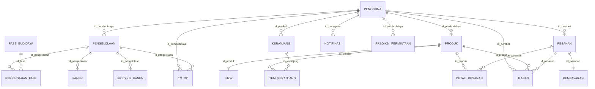

# 🥬 Smart Lettuce — Backend API & Cultivation Management System

REST API backend modern berbasis **Laravel 11** untuk sistem manajemen budidaya selada hidroponik cerdas, prediksi panen & permintaan berbasis AI, serta marketplace langsung dari pembudidaya ke pembeli.

---

## 📌 Fitur Utama

- 🔐 **Autentikasi Token (Sanctum)**: Role-based access control untuk `PEMBUDIDAYA` dan `PEMBELI`.
- 🌱 **Manajemen Pengelolaan Budidaya**: Pencatatan siklus tanam, pemantauan kondisi air nutrisi, pH, instalasi, dan lingkungan.
- 🔄 **Tracking Perpindahan Fase**: Pemantauan tahapan pertumbuhan (*Semai → Vegetatif → Pendewasaan → Panen*).
- 📈 **Prediksi AI**: Estimasi kesiapan waktu panen (*Prediksi Panen*) dan peramalan kebutuhan pasar (*Prediksi Permintaan*).
- 📋 **To-Do List Checklist Harian**: Manajemen tugas operasional perawatan harian pembudidaya.
- 🛒 **Marketplace Selada & Stok Real-time**: Katalog produk segar, stok ternormalisasi, dan keranjang belanja dinamis.
- 💳 **Integrasi Midtrans Payment Gateway**: Checkout otomatis via Snap API (QRIS, Virtual Account, dsb.) serta metode COD.
- ⭐ **Sistem Ulasan Produk**: Ulasan dan rating bintang terverifikasi setelah pesanan selesai.

---

## 🗄️ Entity Relationship Diagram (ERD Bahasa Indonesia)



---

## 📋 Struktur 17 Tabel Database

1. **`pengguna`**: Data akun pengguna dengan role `PEMBUDIDAYA` / `PEMBELI`.
2. **`fase_budidaya`**: Master data tahapan pertumbuhan (*Semai, Vegetatif, Pendewasaan, Panen*).
3. **`pengelolaan`**: Data batch siklus budidaya selada & pemantauan modul.
4. **`perpindahan_fase`**: Riwayat pergerakan fase tanaman antar modul/fase.
5. **`panen`**: Pencatatan hasil panen (jumlah tanaman & berat total kg).
6. **`to_do`**: Daftar checklist tugas harian perawatan kebun.
7. **`notifikasi`**: Pengingat fase, prediksi panen, dan info pesanan.
8. **`prediksi_panen`**: Hasil estimasi AI kesiapan dan perkiraan tanggal panen.
9. **`prediksi_permintaan`**: Hasil perkiraan AI proyeksi kebutuhan pasar per periode.
10. **`produk`**: Katalog produk selada segar yang dijual pembudidaya.
11. **`stok`**: Kuantitas ketersediaan stok produk yang selalu ter-update.
12. **`keranjang`**: Keranjang belanja milik pembeli.
13. **`item_keranjang`**: Rincian produk dan kuantitas di dalam keranjang.
14. **`pesanan`**: Transaksi pemesanan pembeli.
15. **`detail_pesanan`**: Rincian produk, jumlah, dan subtotal yang dipesan.
16. **`pembayaran`**: Pencatatan status pembayaran dan gateway Midtrans.
17. **`ulasan`**: Rating bintang (1–5) dan ulasan produk dari pembeli terverifikasi.

---

## 🚀 Panduan Instalasi & Menjalankan

### 1. Kebutuhan Sistem
- **PHP**: >= 8.2 (dengan ekstensi `pdo_mysql`, `openssl`, `mbstring`, `fileinfo`)
- **Composer**: >= 2.x
- **MySQL / MariaDB**: Database `lettuce_db`

### 2. Setup Awal
```bash
# 1. Clone repository & masuk ke direktori
cd backend-

# 2. Install dependensi composer
composer install

# 3. Salin file environment (jika belum ada)
cp .env.example .env

# 4. Generate Application Key
php artisan key:generate

# 5. Konfigurasi Database di file .env
DB_CONNECTION=mysql
DB_HOST=127.0.0.1
DB_PORT=3306
DB_DATABASE=lettuce_db
DB_USERNAME=root
DB_PASSWORD=

# 6. Konfigurasi Midtrans (Sandbox) di file .env
MIDTRANS_SERVER_KEY=SB-Mid-server-your-key-here
MIDTRANS_CLIENT_KEY=SB-Mid-client-your-key-here
MIDTRANS_IS_PRODUCTION=false
```

### 3. Migrasi Database & Seeding Data Realistis
```bash
# Jalankan migrasi dan isi database dengan data demo Bahasa Indonesia
php artisan migrate:fresh --seed
```

### 4. Jalankan Server API
```bash
php artisan serve
# Server akan aktif di: http://127.0.0.1:8000
```

---

## 👤 Akun Demo Bawaan Seeder

| Peran (Role) | Email | Password | Keterangan |
|---|---|---|---|
| **Pembudidaya** | `petani@lettuce.com` | `password123` | Role: `PEMBUDIDAYA` (GreenHydro Farm) |
| **Pembeli** | `pembeli@lettuce.com` | `password123` | Role: `PEMBELI` (Siti Rahmawati) |

---

## 📚 Ringkasan Endpoint REST API (Prefix: `/api/v1`)

### 1. Autentikasi & Profil

| Method | Endpoint | Akses | Deskripsi |
|---|---|---|---|
| `POST` | `/api/v1/auth/register` | Public | Registrasi akun (`nama`, `email`, `password`, `role`) |
| `POST` | `/api/v1/auth/login` | Public | Login & dapatkan token Bearer Sanctum |
| `POST` | `/api/v1/auth/logout` | Protected | Logout & cabut token aktif |
| `GET` | `/api/v1/profile` | Protected | Ambil info profil user login |
| `PUT` | `/api/v1/profile` | Protected | Update profil & foto |

---

### 2. Modul Pembudidaya (`role: pembudidaya` / `cultivator`)

| Method | Endpoint | Deskripsi |
|---|---|---|
| `GET` | `/api/v1/dashboard` | Metrik dashboard ringkasan budidaya & marketplace |
| `GET` | `/api/v1/fase-budidaya` | Master data 4 tahapan fase pertumbuhan selada |
| `GET` | `/api/v1/pengelolaan` | Daftar siklus batch budidaya (paginated) |
| `POST` | `/api/v1/pengelolaan` | Buat batch pengelolaan budidaya baru |
| `GET` | `/api/v1/pengelolaan/{id}` | Detail batch budidaya + riwayat fase & panen |
| `PUT` | `/api/v1/pengelolaan/{id}` | Update kondisi tanaman, air nutrisi, pH, & modul |
| `DELETE` | `/api/v1/pengelolaan/{id}` | Hapus batch budidaya |
| `POST` | `/api/v1/pengelolaan/{id}/fase` | Catat perpindahan fase tanaman |
| `POST` | `/api/v1/pengelolaan/{id}/panen` | Catat hasil panen batch (kg & jumlah) |
| `GET` | `/api/v1/pengelolaan/{id}/prediksi-panen` | Prediksi AI kesiapan & perkiraan waktu panen |
| `GET` | `/api/v1/prediksi-permintaan` | Prediksi AI tren permintaan pasar |
| `GET` | `/api/v1/to-do` | Daftar to-do list harian operasional |
| `POST` | `/api/v1/to-do` | Tambah to-do tugas baru |
| `POST` | `/api/v1/to-do/{id}/complete` | Tandai tugas to-do selesai |
| `POST` | `/api/v1/produk` | Tambah produk selada ke marketplace |
| `PUT` | `/api/v1/produk/{id}` | Update data & stok produk selada |
| `DELETE` | `/api/v1/produk/{id}` | Hapus produk |
| `GET` | `/api/v1/cultivator/orders` | Daftar pesanan masuk dari pembeli |
| `PUT` | `/api/v1/cultivator/orders/{id}/status` | Update status pesanan (`DIPROSES`, `SIAP_DIAMBIL`, `SELESAI`, `DIBATALKAN`) |

---

### 3. Modul Pembeli (`role: pembeli` / `buyer`)

| Method | Endpoint | Akses | Deskripsi |
|---|---|---|---|
| `GET` | `/api/v1/produk` | Public | Katalog produk selada aktif di marketplace |
| `GET` | `/api/v1/produk/{id}` | Public | Detail produk, stok & riwayat ulasan |
| `GET` | `/api/v1/buyer/dashboard` | Pembeli | Ringkasan riwayat belanja & pesanan aktif |
| `GET` | `/api/v1/keranjang` | Pembeli | Ambil isi keranjang belanja |
| `POST` | `/api/v1/keranjang` | Pembeli | Tambah item ke keranjang (`id_produk`, `jumlah`) |
| `PUT` | `/api/v1/keranjang/items/{id}` | Pembeli | Ubah jumlah item di keranjang |
| `DELETE`| `/api/v1/keranjang/items/{id}` | Pembeli | Hapus item dari keranjang |
| `DELETE`| `/api/v1/keranjang` | Pembeli | Kosongkan keranjang belanja |
| `GET` | `/api/v1/pesanan` | Pembeli | Riwayat pesanan pembeli |
| `POST` | `/api/v1/pesanan/checkout` | Pembeli | Checkout pesanan (`metode_pembayaran`: `QRIS` / `COD`) |
| `GET` | `/api/v1/pesanan/{id}` | Pembeli | Detail pesanan & status pembayaran |
| `POST` | `/api/v1/pesanan/{id}/cancel` | Pembeli | Batalkan pesanan |
| `POST` | `/api/v1/produk/{id}/ulasan` | Pembeli | Beri ulasan & rating bintang 1–5 |

---

### 4. Midtrans Payment Webhook

| Method | Endpoint | Akses | Deskripsi |
|---|---|---|---|
| `POST` | `/api/v1/midtrans/callback` | Public | Webhook notifikasi pembayaran otomatis Midtrans |

---

## 🧪 Menjalankan Automated Tests

Backend dilengkapi dengan rangkaian Automated Feature Tests yang memverifikasi autentikasi, siklus budidaya, keranjang belanja, checkout pesanan, dan alur pembayaran webhook Midtrans:

```bash
php artisan test
```

Hasil Pengujian:
```text
   PASS  Tests\Unit\ExampleTest
   PASS  Tests\Feature\AuthTest
   PASS  Tests\Feature\CartAndOrderTest
   PASS  Tests\Feature\CultivationTest
   PASS  Tests\Feature\ExampleTest
   PASS  Tests\Feature\MidtransPaymentTest

   Tests: 14 passed (63 assertions)
```

---

## 💡 Panduan Integrasi Frontend (JavaScript / Axios)

```javascript
import axios from 'axios';

const api = axios.create({
  baseURL: 'http://127.0.0.1:8000/api/v1',
  headers: {
    'Content-Type': 'application/json',
    'Accept': 'application/json',
  },
});

// Sisipkan Bearer Token otomatis
api.interceptors.request.use((config) => {
  const token = localStorage.getItem('auth_token');
  if (token) {
    config.headers.Authorization = `Bearer ${token}`;
  }
  return config;
});

// Contoh Login
export const loginUser = async (email, password) => {
  const response = await api.post('/auth/login', { email, password });
  localStorage.setItem('auth_token', response.data.data.token);
  return response.data.data.user;
};

// Contoh Checkout Pesanan dengan QRIS (Midtrans)
export const checkoutPesanan = async () => {
  const res = await api.post('/pesanan/checkout', {
    metode_pembayaran: 'QRIS',
  });
  
  const snapToken = res.data.data.pembayaran?.snap_token;
  if (snapToken && window.snap) {
    window.snap.pay(snapToken);
  }
  return res.data.data;
};
```